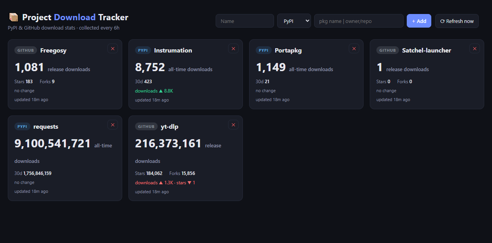

# Project Download Tracker

A self-hosted dashboard that tracks the download numbers of your **PyPI packages** and **GitHub repositories** — so you can see, at a glance, who's actually using the things you build.

Built with FastAPI + SQLite + Chart.js. No API keys required, no external services to sign up for.



## Features

- 📦 **PyPI tracking** — all-time downloads and last-30-days for any package (via [pypistats.org](https://pypistats.org))
- ⭐ **GitHub tracking** — release-asset download counts, stars, and forks (via the public GitHub API)
- 📈 **History charts** — click any project card to see its download trend over time
- ➕ **Add/remove projects from the UI** — no config files to edit, no redeploys
- 🔁 **Self-healing collection** — failed or throttled fetches are retried automatically every 15 minutes
- 🐳 **Docker-ready** — one command to self-host
- 📱 **Responsive dark UI** — works on desktop and phone

## Quick Start

### Docker (recommended)

```bash
docker compose up -d --build
# → http://localhost:8095
```

### Manual

```bash
pip install -r app/requirements.txt
cd app
uvicorn main:app --host 0.0.0.0 --port 8095
# or: python run.py
```

The first time the app starts, it seeds a couple of example projects (`requests` and `yt-dlp`) so you can see the dashboard working immediately. Delete them from the UI whenever you like.

## Adding Projects

Use the **+ Add** form in the dashboard header:

| Type | Identifier | Example |
|------|-----------|---------|
| PyPI | package name (lowercase!) | `rich`, `httpx` |
| GitHub | `owner/repo` | `psf/requests` |

> ⚠️ **PyPI names are case-sensitive at pypistats.org** — always use the lowercase package name (e.g. `requests`, not `Requests`), otherwise the API rate-limits you.

## Configuration

| Env var | Default | Description |
|---------|---------|-------------|
| `PORT` | `8095` | Web UI port |
| `DATA_DIR` | `./data` | Where SQLite DB + seed file live |
| `COLLECT_INTERVAL_HOURS` | `6` | How often to collect stats |

## API

| Endpoint | Method | Description |
|----------|--------|-------------|
| `/api/projects` | GET | All projects + latest snapshot + delta |
| `/api/projects` | POST | Add `{name, type: "pypi"\|"github", identifier}` |
| `/api/projects/{id}` | DELETE | Remove a project and its history |
| `/api/history/{id}` | GET | Full snapshot history for charts |
| `/api/refresh` | POST | Trigger collection now |

## How It Works

- **PyPI**: the collector hits `pypistats.org` (`recent` + `overall` endpoints), sums the `with_mirrors` series for the all-time count.
- **GitHub**: the collector reads repo metadata and sums `download_count` across all release assets.
- Every project snapshot is stored in SQLite (`data/tracker.db`) — no external database needed.
- Collection runs every 6h by default; failed/stale projects are retried every 15 minutes so temporary rate-limits self-heal.

## Notes on Rate Limits

- **pypistats.org** throttles bursts aggressively (~1 req/s per IP, 429 on bursts). The collector fails fast and lets the 15-minute retry loop absorb the throttle window.
- **GitHub API** allows 60 unauthenticated requests/hour per IP — plenty for a personal project list on a 6h cycle.

## License

MIT — see [LICENSE](LICENSE).
